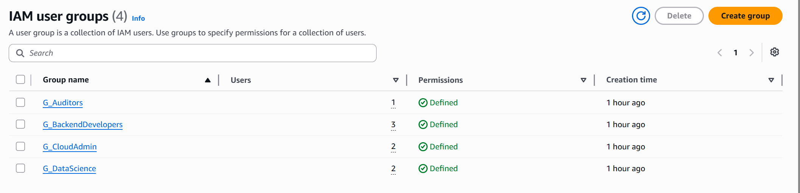
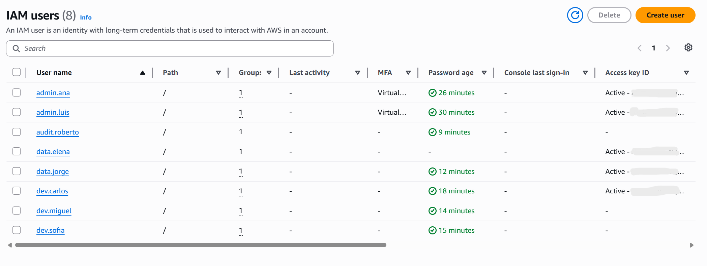
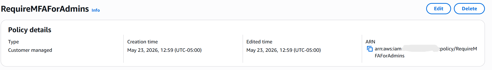
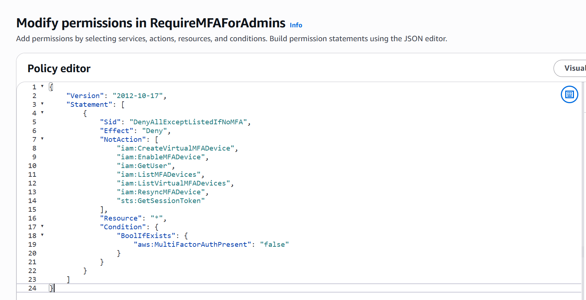

# IAM Security and Role Segregation Workshop

## Project Overview

This workshop demonstrates the implementation of a secure and scalable ``AWS IAM architecture based on the Principle`` of Least Privilege and Role Segregation.

### The solution includes:

- ``IAM`` user provisioning
- ``IAM`` groups by department
- Custom and managed ``IAM policies``
- ``MFA enforcement`` for administrators
- ``Read-only`` access for auditors
- ``Programmatic and console`` access separation

---

## IAM ``Groups``

The following IAM groups were created to organize permissions by department.

## IAM ``Users``

IAM users were provisioned and assigned to their corresponding groups.

## ``MFA`` Enforcement Policy

A custom IAM policy was attached to administrator accounts to deny access when MFA is not enabled.

---

## Security Controls Implemented

- IAM Group-Based Access Control
- MFA Enforcement for privileged users
- Customer Managed Policies
- AWS Managed Policies
- Read-Only Auditor Permissions
- Programmatic Access Control
- Separation of Duties
- Least Privilege Principle

---

# Result

The environment now provides:

- Secure administrative access
- Segregated permissions by department
- Reduced privilege exposure
- Centralized IAM management
- Secure audit visibility through CloudTrail access